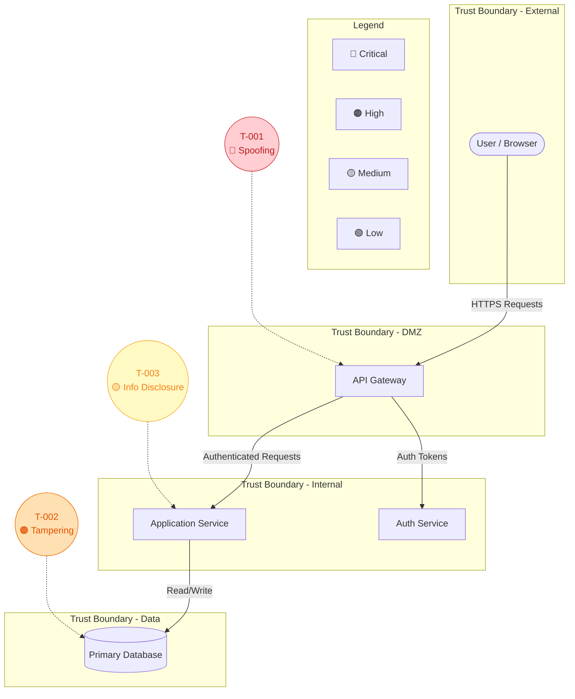

# Generate Threat Model

## Purpose

Take a confirmed architecture diagram and apply STRIDE analysis to produce a prioritised threat model document with a Mermaid threat model diagram.

**Prerequisite**: Run `actions/analyse-repository.md` or `actions/assess-infrastructure.md` first to produce and confirm an architecture diagram.

---

## Flow

### Step 1: Confirm Input 🛑

Verify that an architecture diagram has been produced and confirmed by the user.

| Check | Required |
|-------|----------|
| Architecture diagram (Mermaid) exists | Yes |
| User confirmed diagram accuracy | Yes |
| Components, data flows, and trust boundaries documented | Yes |

If no confirmed diagram exists:

**🛑 STOP**: Direct the user to run `actions/analyse-repository.md` or `actions/assess-infrastructure.md` first.

**Success Criteria:**
- [ ] Confirmed architecture diagram available
- [ ] Component and data flow inventory available

---

### Step 2: Identify Threats Using STRIDE

Load `standards/stride-framework.md`.

Apply each STRIDE category systematically to every component and data flow:

| Category | Question to Ask |
|----------|----------------|
| **S**poofing | Can an attacker pretend to be this component or user? |
| **T**ampering | Can data be modified in transit or at rest? |
| **R**epudiation | Can actions be performed without accountability? |
| **I**nformation Disclosure | Can sensitive data be exposed? |
| **D**enial of Service | Can this component be made unavailable? |
| **E**levation of Privilege | Can an attacker gain higher access than intended? |

For infrastructure-sourced diagrams, pay particular attention to:

| Focus Area | STRIDE Categories to Emphasise |
|-----------|-------------------------------|
| Public endpoints | Spoofing, Denial of Service |
| Data stores | Tampering, Information Disclosure |
| Network boundaries | Spoofing, Elevation of Privilege |
| Identity and access | Spoofing, Elevation of Privilege, Repudiation |
| Data in transit | Tampering, Information Disclosure |
| Logging gaps | Repudiation |

For each identified threat, document:

| Field | Description |
|-------|-------------|
| ID | Unique identifier (e.g., `T-001`) |
| Category | STRIDE category |
| Component | Affected component or data flow |
| Description | What the threat is and how it could be exploited |
| Impact | What happens if the threat is realised (High / Medium / Low) |
| Likelihood | How likely is this threat (High / Medium / Low) |
| Recommended Mitigation | How to address the threat (recommendation only) |

**Success Criteria:**
- [ ] All six STRIDE categories applied to each component
- [ ] Each threat documented with all required fields
- [ ] No categories skipped — "No threats identified" documented where appropriate

---

### Step 3: Generate Threat Model Diagram

Produce a Mermaid diagram that visualises the threats overlaid on the architecture.

#### Diagram Requirements

| Requirement | Details |
|-------------|---------|
| Format | Mermaid flowchart (in a Mermaid fenced code block) |
| Base | The confirmed architecture diagram from the analysis step |
| Threat annotations | Each threat marked on the affected component or data flow |
| Colour coding | Threats colour-coded by priority (🔴 Critical, 🟠 High, 🟡 Medium, 🟢 Low) |
| Legend | Include a legend explaining threat indicators and priority colours |

#### Mermaid Threat Model Diagram Template

````markdown

````

#### Diagram Guidelines

- Use `(("..."))` (double parentheses) for threat nodes to distinguish them from architecture nodes
- Connect threats to their affected component with dotted arrows (`-.->`)
- Apply `classDef` styles for priority colour coding
- Keep the architecture layout from the confirmed diagram — add threats around it
- If the diagram becomes too crowded, produce separate diagrams per trust boundary

**Success Criteria:**
- [ ] Threat model diagram generated in Mermaid
- [ ] All identified threats represented on the diagram
- [ ] Threats colour-coded by priority
- [ ] Legend included
- [ ] Diagram is readable

---

### Step 4: Prioritise Threats with User 🛑

Present the identified threats to the user in a summary table alongside the threat model diagram:

| ID | Category | Component | Description | Likelihood | Impact | Priority |
|----|----------|-----------|-------------|------------|--------|----------|
| T-001 | ... | ... | ... | ... | ... | ... |

Calculate priority using:

| | High Impact | Medium Impact | Low Impact |
|---|------------|---------------|------------|
| **High Likelihood** | 🔴 Critical | 🟠 High | 🟡 Medium |
| **Medium Likelihood** | 🟠 High | 🟡 Medium | 🟢 Low |
| **Low Likelihood** | 🟡 Medium | 🟢 Low | 🟢 Low |

**🛑 STOP**: Work with the user to:
1. Confirm or adjust likelihood and impact ratings
2. Remove any threats the user considers not applicable
3. Add any threats the user identifies that were missed
4. Agree on final prioritisation

If priorities change, update the threat model diagram colours accordingly.

**Success Criteria:**
- [ ] Threats and diagram presented to user
- [ ] Priorities confirmed or adjusted
- [ ] Diagram updated if priorities changed
- [ ] User agrees on final threat list

---

### Step 5: Generate Threat Model Document

Produce the threat model document following `standards/document-template.md`.

The document must include:
1. Executive Summary
2. Architecture Diagram (Mermaid — from the analysis step)
3. Threat Model Diagram (Mermaid — from Step 3)
4. STRIDE Threat Table
5. Prioritisation Matrix
6. Recommendations

Save as a markdown file in the repository (suggest `docs/threat-model.md` or ask user for preferred location).

**🛑 STOP**: Present the completed document to the user. Ask if any changes are needed.

**⚠️ REMINDER: Do NOT implement any fixes. The output is a document only.**

**Success Criteria:**
- [ ] Document follows template structure
- [ ] All sections complete
- [ ] Architecture diagram included
- [ ] Threat model diagram included and renders correctly
- [ ] Document saved to agreed location
- [ ] User confirmed document is complete
