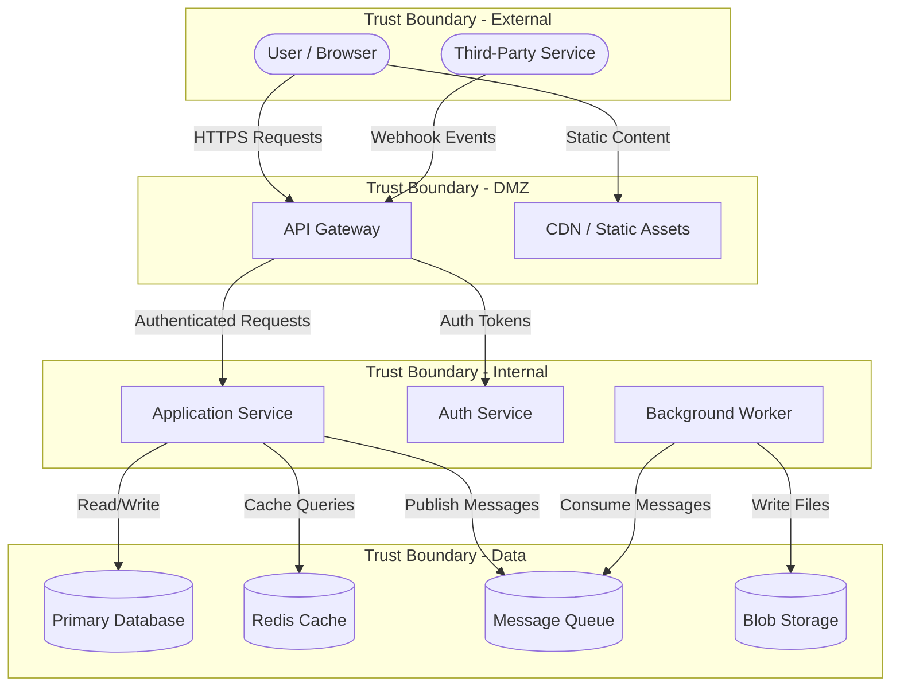

# Threat Model Document Template

## Purpose

Defines the required structure for threat model documents produced by this skill. All threat model outputs must follow this template.

---

## Document Structure

Every threat model document must contain these sections in order:

1. Executive Summary
2. Architecture Diagram
3. Threat Model Diagram
4. STRIDE Threat Table
5. Prioritisation Matrix
6. Recommendations
7. Change Log (for updated models)

---

## Section Templates

### 1. Executive Summary

```markdown
## Executive Summary

**System**: <system or repository name>
**Date**: <date of threat model creation>
**Scope**: <what was analysed — repository, deployed infrastructure, or both>
**Method**: STRIDE framework
**Reference**: [Microsoft Threat Modeling Fundamentals](https://learn.microsoft.com/en-us/training/paths/tm-threat-modeling-fundamentals/)

### Key Findings

| Priority | Count |
|----------|-------|
| 🔴 Critical | X |
| 🟠 High | X |
| 🟡 Medium | X |
| 🟢 Low | X |
| **Total** | **X** |

### Summary

<2-3 sentence overview of the system, what was analysed, and the most significant findings.>
```

### 2. Architecture Diagram

The architecture diagram must be a Mermaid diagram embedded in the markdown document.

#### Diagram Requirements

| Requirement | Details |
|-------------|---------|
| Format | Mermaid flowchart (in a Mermaid fenced code block) |
| Components | All system components represented as nodes |
| Data stores | Represented with cylinder notation or labelled clearly |
| External entities | Visually distinct from internal components |
| Data flows | Directional arrows with labels describing the data |
| Trust boundaries | Represented using subgraphs with clear labels |
| Readability | Diagram must be understandable without additional context |

#### Mermaid Diagram Template

````markdown

````

#### Diagram Guidelines

- Use `([...])` for external entities (stadium shape)
- Use `[...]` for processes (rectangle)
- Use `[(...)]` for data stores (cylinder)
- Use `subgraph` for trust boundaries
- Label every arrow with what data flows through it
- Keep the diagram to one page — split into multiple diagrams if the system is very large

### 3. Threat Model Diagram

A second Mermaid diagram that overlays identified threats on the architecture.

#### Diagram Requirements

| Requirement | Details |
|-------------|---------|
| Format | Mermaid flowchart (in a Mermaid fenced code block) |
| Base | The confirmed architecture diagram |
| Threat annotations | Each threat marked on the affected component or data flow |
| Colour coding | Threats colour-coded by priority (🔴 Critical, 🟠 High, 🟡 Medium, 🟢 Low) |
| Legend | Include a legend explaining threat indicators and priority colours |

#### Guidelines

- Use `(("..."))` (double parentheses) for threat nodes to distinguish them from architecture nodes
- Connect threats to their affected component with dotted arrows (`-.->`)
- Apply `classDef` styles for priority colour coding:
  - `classDef critical stroke:#d32f2f,fill:#ffcdd2,color:#b71c1c`
  - `classDef high stroke:#ef6c00,fill:#ffe0b2,color:#e65100`
  - `classDef medium stroke:#f9a825,fill:#fff9c4,color:#f57f17`
  - `classDef low stroke:#2e7d32,fill:#c8e6c9,color:#1b5e20`
- Keep the architecture layout from the confirmed diagram — add threats around it
- If the diagram becomes too crowded, produce separate diagrams per trust boundary

### 4. STRIDE Threat Table

```markdown
## Identified Threats

| ID | Category | Component | Description | Impact | Likelihood | Priority | Recommended Mitigation |
|----|----------|-----------|-------------|--------|------------|----------|----------------------|
| T-001 | Spoofing | API Gateway | <description> | High | Medium | 🟠 High | <mitigation> |
| T-002 | Tampering | Database | <description> | High | Low | 🟡 Medium | <mitigation> |
```

#### Column Requirements

| Column | Required | Description |
|--------|----------|-------------|
| ID | Yes | Sequential identifier (T-001, T-002, etc.) |
| Category | Yes | One of: Spoofing, Tampering, Repudiation, Information Disclosure, Denial of Service, Elevation of Privilege |
| Component | Yes | Which component or data flow is affected |
| Description | Yes | Clear, specific description of the threat |
| Impact | Yes | High / Medium / Low |
| Likelihood | Yes | High / Medium / Low |
| Priority | Yes | 🔴 Critical / 🟠 High / 🟡 Medium / 🟢 Low |
| Recommended Mitigation | Yes | Specific recommendation (not implementation) |

### 5. Prioritisation Matrix

```markdown
## Prioritisation Matrix

### By Priority

| Priority | Threats | Action |
|----------|---------|--------|
| 🔴 Critical | T-XXX, T-XXX | Address immediately |
| 🟠 High | T-XXX, T-XXX | Address in next sprint |
| 🟡 Medium | T-XXX, T-XXX | Plan for future work |
| 🟢 Low | T-XXX, T-XXX | Accept or monitor |

### By Component

| Component | Threats | Highest Priority |
|-----------|---------|-----------------|
| <component> | T-XXX, T-XXX | 🔴 Critical |
```

### 6. Recommendations

```markdown
## Recommendations

### Critical Priority

1. **T-XXX: <threat title>**
   - **Recommendation**: <specific mitigation>
   - **Rationale**: <why this matters>

### High Priority

1. **T-XXX: <threat title>**
   - **Recommendation**: <specific mitigation>
   - **Rationale**: <why this matters>
```

Recommendations must:
- Be specific and actionable
- Reference the threat ID
- Explain why the mitigation is appropriate
- **Never include implementation code or steps** — recommendations only

### 7. Change Log (For Updated Models)

```markdown
## Change Log

| Date | Reason | Summary of Changes |
|------|--------|--------------------|
| YYYY-MM-DD | <reason for update> | <what changed> |
```

---

## File Naming

| Convention | Example |
|-----------|---------|
| Default location | `docs/threat-model.md` |
| Named model | `docs/threat-model-<system-name>.md` |
| Always ask user | Confirm location before saving |
